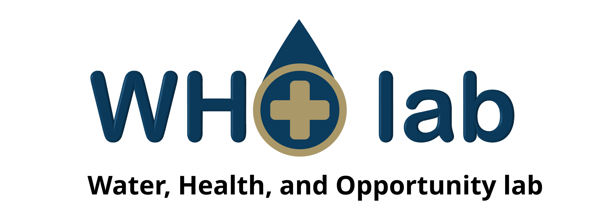

# Welcome to the WHO Lab!

## About the lab

Welcome to the lab of Dr. Xindi (Cindy) Hu, Assistant Professor in Environmental and Occupational Health at the George Washington University Milken Institute School of Public Health. Our mission is to study how clean drinking water and other environmental factors impact population health and health disparities. We conduct rigorous and policy-relevant research to generate evidence at a large scale, leveraging trans-disciplinary approaches spanning exposure science, geospatial data science, and health informatics. To learn more about the lab, visit [xindicindyhu.netlify.app](https://xindicindyhu.netlify.app//).

## About this lab manual

This lab manual covers our communication strategy, code of conduct, and best practices for reproducibility of computational workflows. It is a living document that is updated regularly.

This manual was created with inspiration from [other scientists' lab manuals](https://jadebc.github.io/lab-manual/) and [policies](https://github.com/pzivich/LabGroupMaterials/tree/main). Contributors thus far include Xindi (Cindy) Hu and Jahred Liddie.

Feel free to draw from this manual (and please cite it if you do!).\
     This work is licensed under a <a rel="license" href="http://creativecommons.org/licenses/by-nc/4.0/">Creative Commons Attribution-NonCommercial 4.0 International License</a>.
